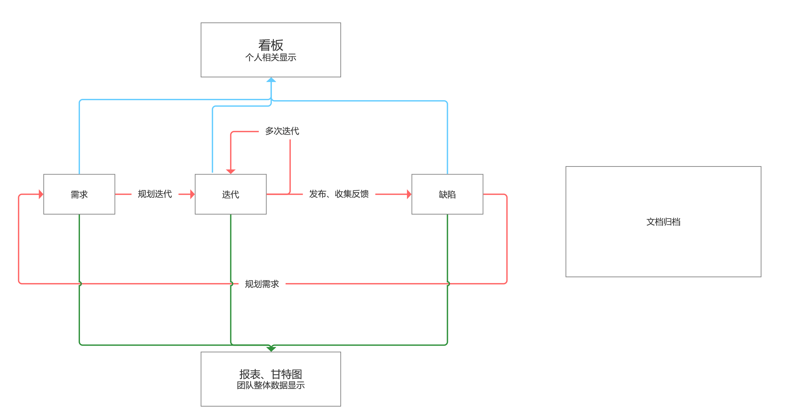

# 在线项目管理服务

## 竞品分析

### 1. Tapd

TAPD（Tencent Agile Product Development），腾讯敏捷产品研发平台 行业领先的敏捷协作方案，贯穿敏捷产品研发生命周期的一站式服务。

#### 特点

1. 可视化的任务分配管理
2. 清晰透明的项目进展
3. 随需而配的功能/流程
4. 文件共享，取用方便
5. 掌握项目质量
6. 移动化支持

#### 业务支持

Tapd支持敏捷研发的业务，使用需求承载需求的设计规划，利用迭代进行迭代的规划跟踪，通过缺陷保证Bug流程可追溯。

#### 工具

##### 需求

产品经理需要对产品相关的用户反馈、已有功能优化、新规划模块等信息进行有效分类，总结归纳，抽丝剥茧，设计成需求，最终形成需求backlog。   

已设计好的需求可通过需求分类进行模块化管理。为了保证研发过程中的风险可控，功能比较复杂的需求往往会被拆解成多个需求，以父子需求的方式进行关联。需求父子层级的引入不仅方便需求拆分，同时也保证了子需求的集中管理。

##### 发布计划

对于大中型的研发团队及产品，产品经理需要制定一个长期的发布计划来控制产品的发布节奏。发布计划可以制定1个或多个，并设定好发布计划的目标，开始及结束时间，以及规划好发布计划待实现的需求。    

##### 迭代

项目经理首先创建一个新的迭代，并设定迭代的目标、开始和结束时间，然后再往迭代里添加本迭代须实现的需求。

##### 任务

开发工程师根据迭代中分配的任务进行开发，每个任务开发完成后及时更新需求/任务的状态，以便团队成员及时了解开发的进度。

##### 测试计划

测试计划是指测试工程师根据需求规划确定的测试范围、测试任务、责任人以及进度安排等。 同时测试工程师还需根据测试计划撰写测试用例。测试用例可以通过测试用例模块来分级管理，也可以直接添加在具体的测试计划中。开发完成后，测试工程师根据测试用例及测试重点进行测试。

##### 测试用例

测试用例是根据具体需求编写的测试场景，单个需求测试点或场景的拆分说明。

##### 缺陷

工程师根据测试计划中规划的测试用例对需求进行测试，针对执行未通过的测试用例可创建缺陷或关联缺陷，并分配给开发人员。   

缺陷单包含了Bug的重现规则、关联需求、优先级和紧急程度等信息。

##### 故事墙

故事墙以卡片的形式，详细地展示了项目的进度。卡片里包含了任务内容、任务优先级、任务负责人、当前状态等信息。

##### 甘特图

甘特图可以从任务和人员两个维度直观展示在预估的时间范围内，每日的工作进展。同时还可以通过成员、时间点、优先级等过滤更精准地了解具体工作进度状况。当出现进度异常时，项目经理可进行沟通调整。

##### **迭代仪表盘**

在迭代仪表盘下，包含了需求统计、需求燃烧图、缺陷统计、任务统计、构建统计、代码质量、部署发布数据等一系列统计图表。此处的图表均为自动生成，无需额外配置，方便团队即时查看。

##### 文档

团队在研发过程中产生的经验积累可以通过文档承载。无论是团队发展过程的记录，还是产品里程碑规划，或者是开发、测试工程师的技术分享都可以在文档中呈现。

##### 反馈

产品交付发布后，产品经理需及时关注用户的反馈，收集用户反馈的问题及优化点，为下一轮需求规划及产品优化做准备，从而保证产品的持续可用。

### 2. Worktile

Worktile 是一站式敏捷研发与DevOps平台，提升研发效能，助力企业更好更快地发布产品

#### 特点

1. 丰富的提醒
2. 高效的任务管理及协作是Worktile的核心
3. 强大的第三方服务集成Worktile目前已集成了100+服务，其中包括主流的代码托管、服务监控及项目管理工具，如Github、监控宝、BugHF、Trello等服务。

#### 业务支持

##### 敏捷研发  

针对企业研发中的难题，提供高效、标准的敏捷，研发管理解决方案，包括 Scrum 和 Kanban

##### DevOps 持续交付

深度整合研发工具链，与敏捷研发数据打通，助力企业构造自动化研发流水线，实现快速构建与发布产品

##### 团队协作

适用于不同行业协作场景，满足项目管理、日程安排、OKR管理、文档协作，以及即时沟通场景

#### 工具

##### 敏捷开发

- 建立需求池、搜集用户故事
- 评审需求、规划迭代
- 进度管理、团队协作
- 用例管理、缺陷追踪
- 评审回顾、总结沉淀

##### 测试管理

- 支持分级管理测试用例，明确用例步骤与预期结果。
- 能够组织测试计划，快速规划测试用例并执行。
- 实时生成测试计划报告与多维度数据报表。

##### Wiki 知识库

Worktile Wiki 提供结构化知识库来记载信息和知识，便于团队沉淀经验、共享资源

### 3. CORNERSTONE

CORNERSTONE是新一代智能项目管理平台。全方位解决企业协作与研发痛点、科学量化团队表现，涵盖任务管理/需求管理/缺陷管理/DevOps/WIKI/在线文档等多种实用功能。

#### 特点

1. 精准智能分析：全方位统计，管理轻松自如。
2. 便捷、高度可配置：多种功能亮点，全新定义项目管理。
3. 快速、敏捷开发：加速价值交付，持续反馈调整。

#### 业务支持

- 个人Portal  ：单一页面聚合所有操作路径，根据个性化操作保留访问路径。
- 项目管理：项目全流程管理、行业领先的报表分析，应用于不同行业。
- 团队协作：项目看板、多模式支持，全闭环流程。
- 敏捷需求规划：在线思维导图，一键生成任务。多个版本迭代管理，复盘便捷。
- 任务管理：提供多视图（表格/看板/甘特图/统计）便于进行任务管理。
- 测试管理：清晰显示用例、缺陷、报告、整合，便于进行产品质量把控。
- 持续集成：快速构建、自动化测试、自动化部署DevOps。
- 文件管理：文件及时分享、多人实时协作。

#### 工具

##### 敏捷

以用户的需求进化为核心，采用迭代、循序渐进的方法进行软件开发。在敏捷开发中，软件项目在构建初期会被切分成多个子项目，各个子项目的成果都经过测试，具备可视、可集成和可运行使用的特征。 

CORNERSTONE为研发团队提供贯穿敏捷研发⽣生命周期的所有功能，帮助团队敏捷迭代，小步快跑。

包含迭代、子系统、Release三种基本工具。

##### 任务

CORNERSTONE提供任务管理模块，且功能强大，用户不仅可任意切换任务，也可同时对多个项目进行管理。

包含任务创建、任务管理、任务检索、批量操作等工具。

##### 需求

需求是产品研发的起点，产品经理进行市场调研以及用户需求调研后，需要将调研结果进行需求分析，找出用户痛点，设计出符合用户需求的产品。

CORNERSTONE的需求管理功能可帮助产品经理排出需求的优先级、明确需求流程和责任人、提高协作效率低下，使需求状态一目了然。

##### 缺陷

CORNERSTONE的缺陷管理模块可帮助企业进行缺陷全流程管理，还可以与测试、任务管理等模块相关联。

##### 测试

在敏捷开发过程中，需要对测试需求、计划、用例和实施过程进行管理，从而保证软件功能符合规范。 CORNERSTONE提供了测试用例和测试计划模块，帮助进行测试管理。

## 项目设想

本项目为在线项目管理服务软件，主打轻便、简介、移动端的特点，采用敏捷开发的流程，给予企业从项目提出设想到开发、测试、发布、迭代、反馈各个环节的管理服务。

### 产品特点

1. 敏捷研发
2. 可视化操作
3. 团队项目协作管理
4.  文件管理系统
5. 多端协作、移动化支持
6. 方便的项目进度分析图表工具

### 业务支持

1. 个人任务可视化管理
2. 团队进度可视化协同管理
3. 文件归档管理
4. 需求、开发、测试、发布、迭代进度管理
5. 多视图多方式项目分析

### 包含工具

1. 需求

   产品需求被称为 User Story 或 Story，是从用户的角度来描述的独立功能点。

2. 任务

   与需求从用户纬度出发不同，任务从开发纬度出发，着重具体的实现方法。  
   需求可以拆分为任务，任务也可以主动关联需求

3. 迭代

   迭代是一个固定的时间段 Timebox，每个迭代都将研发一定数量的需求、产出一定数量的可交付的特性。项目通过迭代的不断滚动和快速发布，可以让产品开发更加敏捷。

4. 缺陷

   包含缺陷模板配置、缺陷工作流配置，以及缺陷的导入、导出、高级查询功能

5. 看板

   看板直观展现了团队工作项。团队可以快捷地创建工作项，根据需要自定义各板块，就像使用实体白板与任务卡片一样便捷简单。无论是团队目标制定、成员任务管理，亦或是市场推广、人力资源管理、产品研发管理等工作，使用看板都可以轻松实现。

6. 文档

   提供在线文档、思维导图和文件管理功能，适合不同的操作场景。

      - 在线文档支持团队成员协同编辑场景，提供富文本和 Markdown 两种书写方式，即写即存。
      - 思维导图也支持多人协同编辑，方便团队成员在线脑暴，碰撞创意。
      - 文件管理则使得团队成员可以在文档应用中共享、关注和下载文件，并通过文件夹将文件进行分类，实现对于工作文件的一站式管理。

7. 报表

   报表应用提供了丰富的统计分析功能，帮助项目团队量化统筹管理项目，其中包括：

      - 需求分布统计、需求时长统计、需求关联统计；

      - 缺陷分布统计、缺陷趋势统计、缺陷年龄统计、其他缺陷报表；

      - 看板工作项统计；

      - 进度跟踪、工时花费报告。

8. 甘特图

   甘特图亦称条形进度表。通过横轴表示时间、纵轴表示要安排的活动的一组线条，直观地表明工作项的时间规划，以及实际进展与规划的对比。  

   - 普通甘特图  
     从工作项维度，直观呈现需求、任务的活动时间范围。

   - 资源甘特图  
     按处理人/开发人生成甘特图，以按处理；  
     从人员维度，直观查看各人员当前的工作计划、任务完成情况、时间利用率等。

### 使用

项目在需求提出时，使用需求管理创建需求与子需求。   

当拆分出任务时，使用任务管理对任务进行分配、设定、配置，建立迭代。    

用户在看板可以看到自己的相关，并且也可以通过各种报表、甘特图来分析当前项目进度，进而对项目的进度进行调控。

对整个项目的过程，可以进行文档同步的归档。   

## 盈利分析

### 项目管理类产品盈利调查

#### 1. 调查对象

Tapd、Wortile、Cornerstone

#### 2. 免费服务内容

- 看板 ：完成对团队任务的基本操作
- 思维导图：使用一个中央关键词或想法引起形象化的构造和分类的想法，用一个中央关键词或想法以辐射线形连接所有的代表字词、想法、任务或其它关联项目的图解方式。
- 在线文档：支持个人文档，项目文档。文档支持在线思维导图、富文本、Office全家桶。思维导图支持实时协作，支持转为需求。文档支持实时协作，支持markdown
- 统计
- 企业微信集成：与企业微信配合，方便管理

#### 3. 付费内容（专业版）

- DevOps：Development+Operations，一组过程、方法与系统的统称，用于促进开发、技术运营和质量保障（QA）部门之间的沟通、协作与整合。是一种重视“软件开发人员（Dev）”和“IT运维技术人员（Ops）”之间沟通合作的文化、运动或惯例。透过自动化“软件交付”和“架构变更”的流程，来使得构建、测试、发布软件能够更加地快捷、频繁和可靠。
- 流水线 ：优化团队合作任务的进程
- 任务、测试计划、工时、测试用例 
- 发布计划、发布评审
- 甘特图：甘特图以图示通过活动列表和时间刻度表示出特定项目的顺序与持续时间。一条线条图，横轴表示时间，纵轴表示项目，线条表示期间计划和实际完成情况。直观表明计划何时进行，进展与要求的对比。便于管理者弄清项目的剩余任务，评估工作进度。甘特图是以作业排序为目的，将活动与时间联系起来的最早尝试的工具之一，帮助企业描述工作中心、超时工作等资源的使用。
- 专人客服服务咨询、协助部署

#### 4. 盈利模式

此类项目管理服务软件大多数为免费使用加付费额外的模式。

首先给出一些基本的管理功能，比如在线文档和统计等。基本功能可以满足大多数管理者的需求。后续推出专业版或者企业版的升级模式，加入了更多专业的功能和需求满足，可以应用于更为专业的项目管理。

疫情期间许多公司选择将专业版也划归为免费使用的范畴，用以吸引客户。

### 盈利模式

本项目管理服务软件采取免费基础版加额外收费的盈利模式

**·免费基础版：**
	本着服务客户需求的原则，本软件给予的基本模式可以适用大多数项目需求。
	基础版包括如下几个基本功能：
	-需求：需求模板配置、需求工作流配置
	-看板：团队任务进程清晰可见
	-思维导图：关键词形象化进行分类汇总
	-在线文档：协作完成任务
	-任务：显示特性，任务精细化管理
	-迭代：产品开发更加敏捷
**·进阶收费版：**
	收费版面向于专业团队，更加敏捷高效。
	-甘特图：直观表明工作项的时间规划，以及实际进展与规划的对比
	-缺陷：缺陷模板配置、缺陷工作流配置
	-报表：统计分析功能，帮助项目团队量化统筹管理项目
	-测试计划：规划确定的测试范围、测试任务、责任人以及进度安排
	-测试用例：进阶测试管理模式

**盈利计划：**
	产品推出之初，基础版和进阶版全部免费试用，后期客户数量稳定后，采取进阶收费模式。